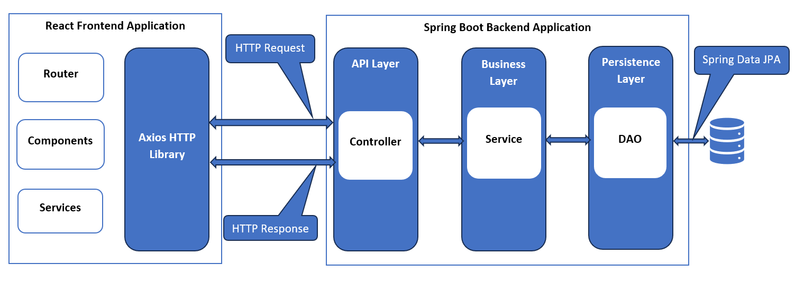
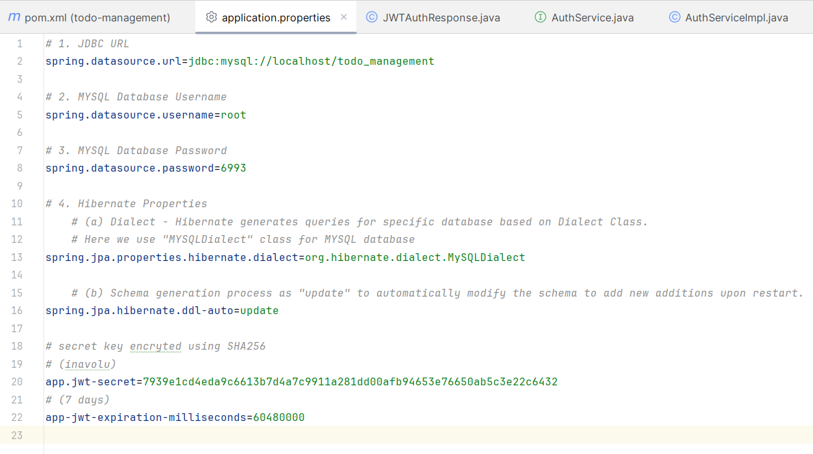
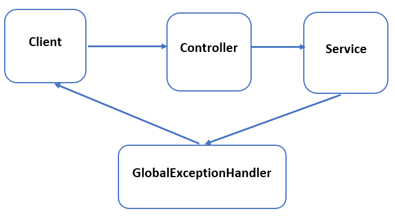

# Task Management System 

## Technology Stack
**Java Platform**	  : Java 17

**Java Frameworks**	 :  Spring Boot 3, Spring Security 6 and Spring Data JPA(Hibernate 6)

**Front End Development** :  ReactJS, Vite Js, BootStrap CSS, JavaScript, NPM, Axios

**Token Based Authentication** :  JWT (Json Web Token)

**Build Tool**	: Maven

**IDE**	 : IntelliJ IDEA, Visual Studio Code

**Server**	: Tomcat server

**Database** :	 MySQL database

**REST Client**	: Postman

## Spring Boot React Full Stack Architechture
Spring Boot React Full Stack Architechture follows client-server model

Spring is a robust Java-based open-source framework that is widely used for enterprise web applications. Spring boot is an extension of the spring framework which is used to build production-ready applications quickly.
  -	The Third party library Axios is used in React to make the REST API call to Spring REST Controller by passing JWT token in the HTTP header.
  -	The request goes to the controller, who maps and processes that request. After that, service logic is called.
  -	In the service layer, all the business logic is performed. It performs the logic on the data that is mapped to JPA with model(DAO) classes.
  -	If there is no error, the web page is returned to the user.

 
 
## Maven dependencies
In the context of Maven, a dependency is a JAR file used by a Java application. Maven will automatically include JAR file in java path if it identifies a dependency listed in POM.xml file. Then, Java will be able to find and use the classes in the JAR file.
1.	**spring-boot-starter-data-jpa:** Spring Data JPA focuses on using JPA to store data in a relational database. JPA is a specification that facilitates object – relational mapping to manage relational data in java applications. Spring Data JPA  is not a JPA provider. It uses Hibernate as a default JPA provider. Hibernate will generate SQL queries based on the method call and executed using JDBC.
2.	**spring-boot-starter-web:** Spring Boot Starter Web is used for building RESTful applications using Spring MVC. If we have this dependency then the application comes under Servlet category of Spring Boot application.
3.	**mysql-connector-j:** mysql-connector-j is a JDBC Type 4 driver, meaning it is a pure Java implementation of the MySQL protocol .
4.	**modelmapper:** ModelMapper is an object mapping library that is used to convert JPA entity into DTO and vice versa in a Spring boot application.
5.	**spring-boot-starter-security:** Adding spring-boot-starter-security dependency will automatically secure all HTTP endpoints with basic authentication.
6.	**jjwt-impl, jjwt-api, jjwt-jackson:** These dependencies are used to create and verify JSON Web Tokens (JWTs) on the JVM.

## Database Connection
Connection to MYSQL database is configured in “application.properties” file as follows:

 

## Implementation of REST APIs 
1.	Task(TODO) Management CRUD Rest APIs
   
|Operation|Endpoint|Request Body|Response|
|:-----:|:-----:|:-----:|:-----:|
|Add Task|POST/api/todos|Task Details|Newly created Task details|
|Get Task|GET/api/todos/{id}|-|Details of Specific Task|
|Get All Tasks|GET/api/todos|-|List of all Tasks|
|Update Task|PUT/api/todos/{id}|Task Details|Updated Task details|
|Delete Task|DELETE/api/todos/{id}|-|Confirmation of Deletion|
|Complete Task|PATCH/api/todos/{id}|-|Marks Task as Complete|
|InComplete Task|PATCH/api/todos/{id}|-|Marks Task as in Complete|

2.	Security Management - Secure all REST APIs using Spring Security and implement Role based Authentication
   
|Operation|Authorised Role|
|:-----:|:-----:|
|Add Task|Admin|
|Get Task|Admin, User|
|Get All Tasks|Admin, User|
|Update Task|Admin|
|Delete Task|Admin|
|Complete Task|Admin, User|
|InComplete Task|Admin, User|

## Exception Handling
1.	Client sends a request to rest API.
2.	Rest APIs are defined in the controller class. Rest API will handle the request and send it to the service class.
3.	The Service class will validate the request parameter and if the request parameter is not valid then it will throw the exception.
4.	GlobalExceptionHandle class is manually created to handle exceptions. The exception thrown in service class is handled in the GlobalExceptionHandle class and sends the error response to client.
 
## JWT Authentication
JSON  Web Token(JWT) is an open standard for securely transmitting data between client and server as a JSON object. JWT follows stateless authentication mechanism. 
The disadvantage of using Spring Security basic authentication is that every time while calling a Rest API, the client should provide hardcoded username and password in the header of REST API request. But with the addition of JWT to spring security, authentication goes as follows
1.	Client will call the Login API using username and password
2.	Login API(server) will validate the user name and password. If the credentials are valid then JWT token is created using secret key and returns it as part of response to client
3.	Once client receives the JWT token then client should pass JWT token in the header of the request.
4.	Server then validate JWT using secret key and return the response to client.

 

